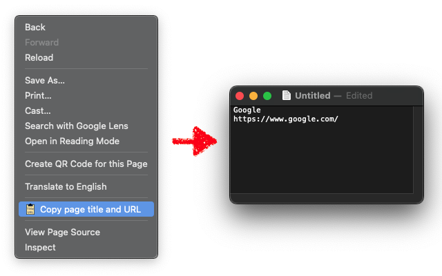

# title-clipper

A Chrome extension that copies the page title and URL.



## How it works

1. Open the context (right-click) menu
2. Select "Copy page title and URL"
3. You can paste "Title <BR> URL", for example:

> Page title
>
> https://...

## Supported websites

Any websites.

See [manifest.json](manifest.json) for the complete list.

## Installation

### Chrome Web Store

This extension is available at Chrome Web Store:

> Copy page title and URL from context menu
>
> https://chromewebstore.google.com/detail/copy-page-title-and-url-f/bggilabpedndenjgipknecphakliieba

Please give us a ⭐️⭐️⭐️⭐️⭐️ review if you like it.

### Local

See "Loading an unpacked extension" section of the Google's documentation:

> Chrome Extension development basics - Chrome for Developers
> https://developer.chrome.com/docs/extensions/mv3/getstarted/development-basics/

## Development

Install prettier and eslint:

```
pnpm i
```

Run prettier:

```
pnpm format
```

Run eslint:

```
pnpm lint
```

Packaging to package.zip:

```
pnpm package
```

## License

[ISC](LICENSE)

## Author

[@mikan](https://github.com/mikan)
